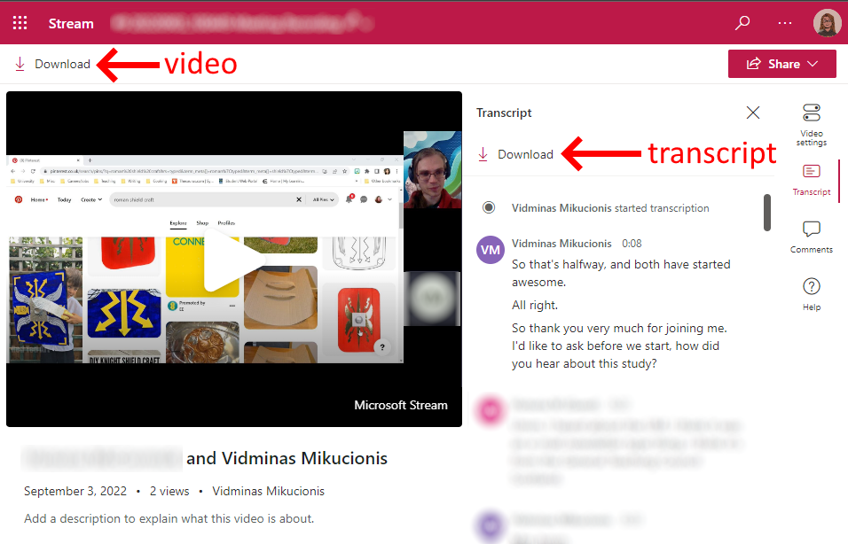

# Convert Teams Transcripts for Atlas.ti

This utility converts Microsoft Teams transcripts for Atlas.ti, fixing import issues still present as of 2022. Click [here](converter.html) to go straight to the utility.

## Introduction

[Microsoft Teams](https://twitter.com/MicrosoftTeams) does surprisingly good automated transcription and these transcripts can be downloaded along with the corresponding recordings. 

This utility allows you to use these transcripts with Atlas.ti, the popular qualitative analysis software. It's written in HTML and JavaScript so only requires your browser to run. All processing is done locally, so your data is not uploaded anywhere and never leaves your computer.

Atlas.ti natively supports VTT transcripts, however, it fails to import timestamps correctly for automated Teams transcripts. This is because Atlas.ti expects all timestamps to be zero-padded, for example, `0:0:0.0 --> 0:0:3.580` breaks but `00:00:00.00 --> 00:00:03.580` works.

Teams transcription times aren't always aligned with the start of the recording, so this also implements a 'time shift'.

## Instructions

These instructions are for importing from Teams to Atlas.ti 9:

* Record your interview in Teams, creating a transcript 

* The video and transcript appear as entries in due course in the chat (**The transcript may take several hours to produce**)

* 

* On the transcript in the chat, click *... Download as .vtt*

* On the video, click *...* and *Open in Microsoft Stream.* Scroll down to Details tab, and click *... Download video*.

* 

* Optionally, if you want audio only, click on the downloaded video file to open in Quicktime; use *File - Export As - Audio Only* to get an m4a file

* From the same page also download the transcript (this will not be the same as the file from the Teams chat! The Microsoft Stream version contains cue titles, notes, and timestamps that correctly line up with the recording, but it is missing speaker details)

* Use the [converter page here](converter.html) to combine the two .vtt files into one transcript that is ready for import into Atlas.ti
    
* Follow the official instructions to import it: <https://doc.atlasti.com/ManualWin.v9/Transcription/ImportingAutoTranscripts.html>

## Removing interviewer encouragements

You may also find in an interview that there are a lot of 'ums' and 'yes' that break up the flow.

To fix that, just tick the *Filter out short phrases* box on the coverter page. It removes all interjections less than 10 words long. To check you've not missed anything important, the converter shows the list of all words filtered out.

## Credits

This work is based on:
* Charles Weir's code for converting VTT transcripts for NVivo: https://github.com/SecurityEssentials/Teams2NVivo

With additional inspiration from:
* Steve Wright's blog post: https://caqdasblog.wordpress.com/2020/12/08/using-atlas-ti-to-correct-and-code-automatically-generated-transcripts-from-teams-or-zoom/
* Tim Ellis' code for modifying VTT transcripts: https://github.com/TimEllis/vttprocessor
